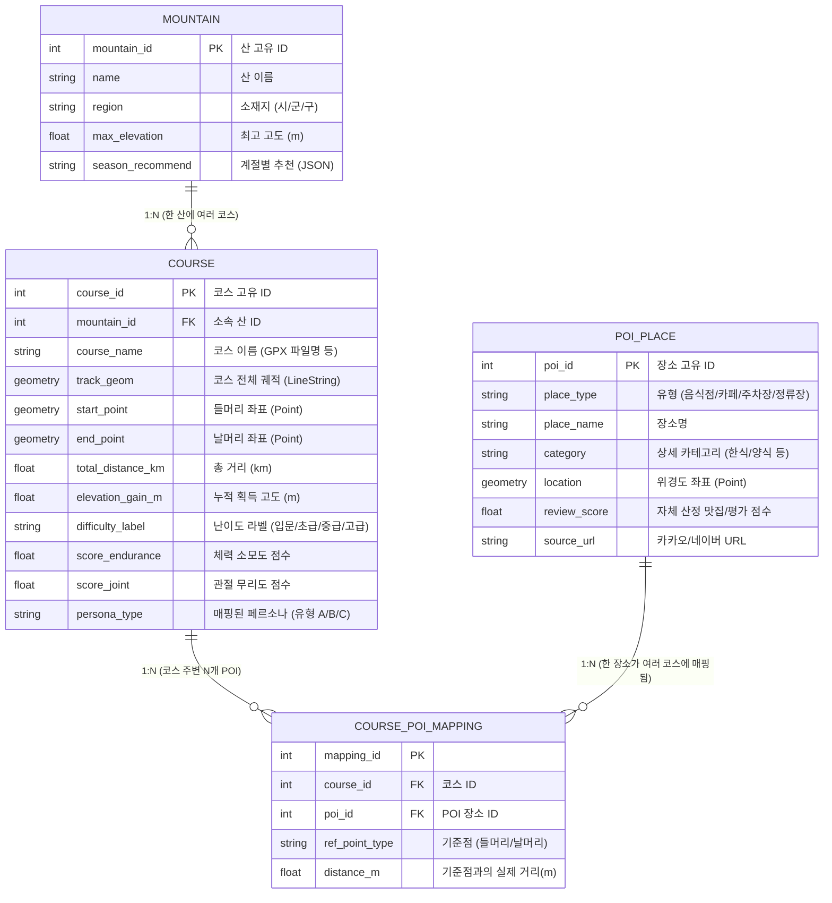

# PeakFit Scale-up DB Schema (ERD 초안)

전국 단위(약 4,000개 이상의 산, 수만 개의 등산로 코스, 수십만 개의 POI)로 데이터를 확장할 때, 현재의 CSV 기반 단일 테이블 구조를 **관계형 데이터베이스(RDBMS: PostgreSQL 등)** 구조로 정규화하여 관리해야 합니다. 공간 쿼리(Spatial Query) 최적화를 위해 **PostGIS** 확장을 사용하는 것을 권장합니다.

### 💡 ERD 설계의 핵심 포인트 (Scale-up 최적화)

1.  **공간 데이터(Geometry) 타입 활용 (PostGIS)**
    *   기존처럼 `Start_Lat`, `Start_Lon`을 분리해서 저장하고 파이썬으로 Haversine을 매번 돌리면 전국 단위 데이터 연산 시 성능 부하가 큽니다.
    *   `Point` 및 `LineString` 타입으로 저장하여 데이터베이스단에서 `ST_DWithin()` 같은 공간 인덱스(R-Tree) 쿼리를 통해 반경 1km 내 맛집을 0.1초 만에 뽑아낼 수 있습니다.
2.  **`COURSE`와 `POI_PLACE`의 M:N 매핑 테이블 분리**
    *   맛집, 주차장, 버스정류장은 특정 산에만 종속되는 것이 아니라 여러 산의 하산 지점과 겹칠 수 있습니다.
    *   `COURSE_POI_MAPPING`이라는 중간 매핑 테이블을 두고, 배치(Batch) 작업으로 매일 밤 "어느 코스 들머리/날머리에서 반경 1km에 있는지"를 미리 계산하여 Insert 해둡니다. 유저가 조회할 때는 이 매핑 테이블만 읽으므로 속도가 매우 빠릅니다.
3.  **JSON/Array 데이터 타입 활용**
    *   해시태그(`Final_Curation_Tags`)나 `위험요인_목록`은 배열(Array)이나 JSONB 형태로 `COURSE` 테이블에 저장하여, 앱 프론트엔드에서 파싱 없이 즉시 태그 컴포넌트로 뿌려줄 수 있도록 구성합니다.
